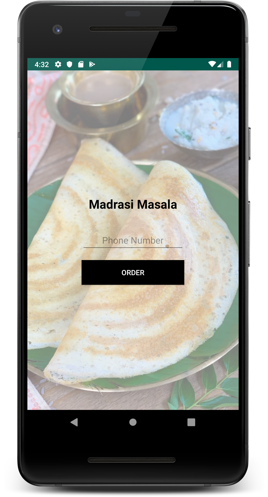

# Madrasi

An Android App demonstrating [Uber/RIBs](https://github.com/uber/RIBs) architectural framework.

## Screenshot

## The Anatomy of RIBs

Presentation given at Droidcon India 2019

- [Speakerdeck](https://speakerdeck.com/chetdeva/the-anatomy-of-ribs)
- Video (Coming soon)

