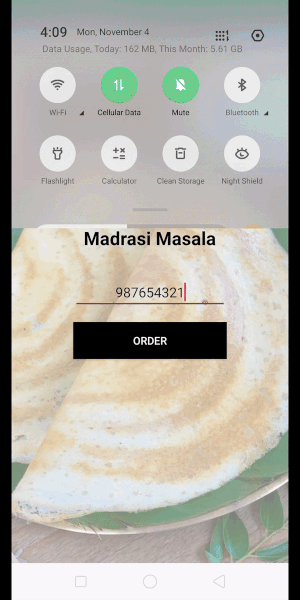
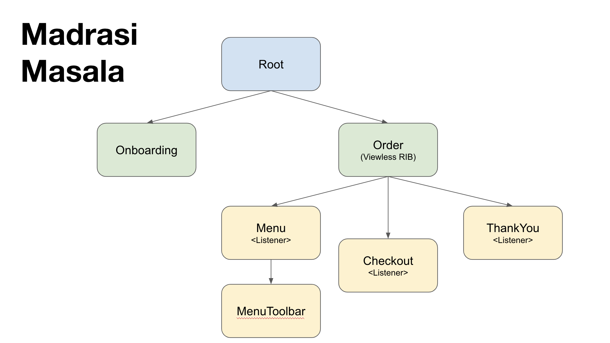

# Madrasi

A "Restaurant Food Ordering" Android App demonstrating [Uber/RIBs](https://github.com/uber/RIBs) architectural framework.

## Screencast

## RIB Tree

## The Anatomy of RIBs

Presentation given at [Droidcon India 2019](http://droidcon.in/)

- [Speakerdeck](https://speakerdeck.com/chetdeva/the-anatomy-of-ribs)
- Video (Coming soon)

